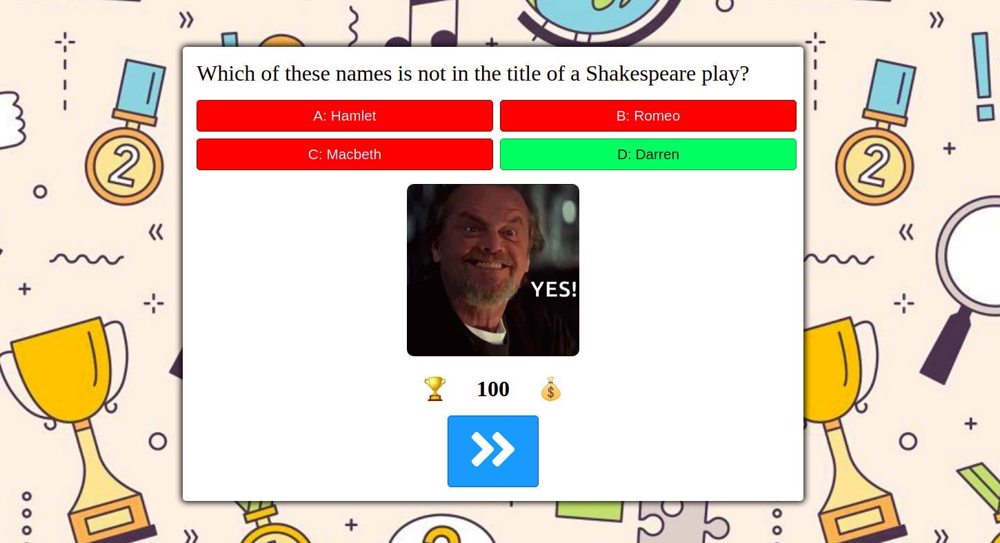

# Quiz Game

[Live Version](https://sempris.github.io/quiz-game/)

This quiz game was made for the module project of Programming basic at DCI.

The purpose of the module project is to showcase the knowledge of basic JavaScript.

DOM manipulation and onClick events were not in the curriculum of the module but I just wanted to give this app at least a basic user interface and styling.

Technologies used:

- onClick event
- closure function
- DOM manipulation

v 0.1 - basic interface and functionality are available.

v 0.2 - mobile optimization added.